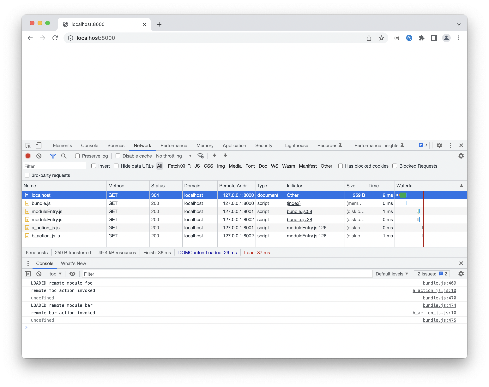

# Simple Webpack Module Federation Demonstration

This repo provides a very simple demonstration of how Webpack's module federation works.

The repository contains four projects:

- A host app project `host-app`
- Three remote module projects: `remote-module-foo`, `remote-module-bar` and `remote-module-baz`

The host app and the three remote modules are all served from their own local server:

- host on `localhost:8000`
- remote module foo on `localhost:8001`
- remote module bar on `localhost:8002`
- remote module baz on `localhost:8003`


## Setup

1. `yarn install`
2. `yarn projects:install:all`
3. `yarn projects:build:all`


## Running the Demonstration

- To serve host and the remote modules, run `yarn projects:serve:all`
- To shutdown the local servers, run `yarn projects:shutdown:all`

When the servers are all running, open your browser and go to `http://localhost:8000`. In your browser's JavaScript console, you should see the following output:

```
HOST says hello world!
Loaded remote module foo
remote FOO action invoked
Loaded remote module bar
remote BAR action invoked
Loaded remote module baz
remote BAZ action invoked
```

In your browser's inspector network tab, you should see the following files being loaded in this order:

```
localhost:8000: index.html
localhost:8000: host-vendor.bundle.js
localhost:8000: host-main.bundle.js
localhost:8001: moduleEntry.js
localhost:8002: moduleEntry.js	
localhost:8003: moduleEntry.js	
localhost:8001: host-app_js.bundle.js
localhost:8001: foo-action_js.bundle.js
localhost:8002: bar-action_js.bundle.js
localhost:8003: baz-action_js.bundle.js
```



## What's happening in this demonstration?

When you load the host app, the app's `main` [function](https://github.com/mlcohen/simple-webpack-module-federation-demonstration/blob/main/host-app/src/main.js) will execute. When invoked, the `main` function will dynamically import three modules: First `RemoteModuleFoo/action` then `RemoteModuleBar/action` and finally `RemoteModuleBaz/action`.

When a remote module has been loaded, the host app will execute an exported function from imported module. For the foo remote module, the exported `doRemoteFooAction` [function](https://github.com/mlcohen/simple-webpack-module-federation-demonstration/blob/main/remote-module-foo/src/action.js) is invoked, and for the bar remote module, the exported `doRemoteBarAction` [function](https://github.com/mlcohen/simple-webpack-module-federation-demonstration/blob/main/remote-module-bar/src/action.js) is invoked, and for the baz remote module, the exported `doRemoteBazAction` [function](https://github.com/mlcohen/simple-webpack-module-federation-demonstration/blob/main/remote-module-baz/src/action.js) is invoked.

Each remote module is loaded in series with a bit of delay added in between. This is to help emphasize how remote module are loaded by Webpack.

This demonstration also showcases how modules can be shared among federated modules. Here `lodash/toUpper` is shared amoung the host app to the three remote modules.

## What is module federation?

Module federation allows any project made up of a collection of modules to be built, bundled and deployed in a way where they can be dynamically fetched and loaded at runtime by a Webpack compliant host. These federated modules, also referred to as _remote modules_ do not need to be available at build time for the host to be built. The benefit is that each project representing a federated module can be independently maintained, tested, built and deployed. This means the applications that host remote modules can then be smaller, quicker to build, quicker to load, and not be concerned about how each federated module is built and deployed. All that a host needs to know is:

1. The name of the federated module
2. What a federated module exports for public use
3. Where the federated module can be fetched from

Module federation opens the doors for microfrontends where you can independently maintain and deploy small web applications such that each application can be both a host _and_ a remote module. This is referred to as _bidirectional hosting_.

## How does module federation work?

Let's start with the basics: Setting up projects representing a host and remote modules.

### Setting up a remote module

For any project that is representing a remote module, you need to include Webpack's `ModuleFederationPlugin` [plugin](https://webpack.js.org/plugins/module-federation-plugin) in the project's `webpack.config.js` file. At a minimum, you specify:

1. The *name* of the remote module
2. The name of the file representing the remote module's entry
3. What the remote module exposes for use

For example, let's say you want to create a remote module *Foo* that exports (or _exposes_) a submodule called _action_. You'd have the following:

```js
// webpack.config.js (using Webpack v5)
const ModuleFederationPlugin = require("webpack/lib/container/ModuleFederationPlugin");

module.exports = {
    ...
    plugins: [
        new ModuleFederationPlugin({
            name: "Foo",
            filename: "moduleEntry.js",
            exposes: ["./action"],
        }),
    ],
};
```

Each part in the remote module project's configuration is important as it will be needed by a host to use it.

### Setting up a host

Setting up the host application to use remote modules requires:

1. Updating the app's `webpack.config.js` file to use the `ModuleFederationPlugin` plugin
2. Making use of the global `import()` function to import _exposed_ submodules from a remote module

#### Configuring the host

Like remote modules, the host application also makes use of Webpack's `ModuleFederationPlugin` plugin but, unlike remote modules, you are configuring the plugin to tell it what remote modules to use and how the host retrieves the remote modules. Here we want the host to use the *Foo* remote module.

```js
const ModuleFederationPlugin = require("webpack/lib/container/ModuleFederationPlugin");

module.exports = {
    ...
    plugins: [
        new ModuleFederationPlugin({
            name: "host",
            remotes: {
                Foo: `promise new Promise((resolve) => {
                    const script = document.createElement("script");
                    script.src = window.FooUrl + "/moduleEntry.js";
                    script.onload = () => {
                        const m = {
                            get: (request) => window.Foo.get(request),
                            init: (arg) => {
                                try {
                                    return window.Foo.init(arg);
                                } catch (e) {
                                    console.log("Foo has already been loaded");
                                }
                            },
                        };
                        resolve(m);
                    }
                    document.head.appendChild(script);
                }`,
            },
        }),
    ],
};
```

We use the plugin's `remotes` field to tell Webpack that we want to use the *Foo* remote module. The value assigned to the key _Foo_ is a stringified promise. This promise is what Webpack will use to fetch and load the remote module. The promise will create a DOM script element to fetch the remote module's entry file (`moduleEntry.js`). Once the entry file has been retrieved and loaded, the promise is resolved by passing back the *Foo* module's entry interface (an `init` and `get` function). This interface is what Webpack uses to import functionality from the remote module.

Do you really need to explicitly write this promise logic? Well, no. Making your own explicit promise is useful when you want complete control over remote module loading. Instead, you can use the `ExternalTemplateRemotesPlugin` [plugin](https://www.npmjs.com/package/external-remotes-plugin) that will essentially do the same thing. But seeing the promise logic makes it clear how Webpack goes about retrieving and loading remote modules. 

#### Importing remote modules

For a host application to import something from a remote module, the application must use the `import()` function. `import` is an [ES6 feature](https://developer.mozilla.org/en-US/docs/Web/JavaScript/Reference/Operators/import) that all major browser vendors (and nodejs) implement. To import something from the *Foo* remote module, we do the following:

```js
import('Foo/action').then(({ doAction }) => {
    doAction();
});
```

It's that simple.

Above, we want to access the `doAction` function in the `Foo/action` module. `import` returns a promise and when resolved returns the module that gives you access to what the module exports. Behind the scenes, Webpack is doing a lot of work to carefully retrieve and load the `action` module.

## What does Webpack actually do to make module federation work?

Behind the scenes, Webpack does a bunch of work to keep track of modules. Making sure modules are correctly imported based on what a module exports and how it exports functionality. Much if not all of this logic is automatically added by Webpack during the build and bundling process. Therefore, to understand how module federation _really works_ under the hood, you need to have some reasonable familiarity with how Webpack manages modules.

### Module Fundamentals

Every file that imports and/or exports is considered a module. In the case of JavaScript files, Webpack inheritly understands how to infer what a file, or rather _module_, is importing and exporting whether it be via [CommonJS](https://blog.risingstack.com/node-js-at-scale-module-system-commonjs-require/) (ie. `require` and `module.exports`), [ES6](https://www.digitalocean.com/community/tutorials/js-modules-es6) (ie. `import`, `export` statements) or some other common(-ish) JS modulization approach such as [AMD](https://requirejs.org/docs/whyamd.html). With this inherit knowledge, Webpack directly takes over the underlying mechanics of doing the actual importing and exporting.

In a basic Webpack application that has one [defined entry point](https://requirejs.org/docs/whyamd.html) and one [defined output](https://webpack.js.org/concepts/#output) with and no use of dynamic importing, module federation, or any kind of configuration that causes Webpack to split modules up into _chunks_, the static bundle produced will contain all of the JavaScript modules that Webpack was able to resolve. Resolve based on what is being imported, starting from the file representing the entry point. Essentialy Webpack creates a graph of modules that it can then process. The result of this is that for each imported module that Webpack comes across, Webpack will add that module to the bundle by wrapping the module's code up in a closure and mapping the closure to a key. The key being a unique relative path to the module.

Let's put this into more concrete terms.

To start, we have a simple application with a single main entry file called `main.js`. Main imports a file called `utils.js` located in the same directory. Both are located in the project's `src/` directory. 

```js
// src/utils.js
function toUpper(str) {
    return str.toUppercase();
}

module.exports = {
    toUpper,
};
```

```js
// src/main.js
const { toUpper } = require("./utils");

function main() {
    console.log(toUpper("Hello world"));
}

main();
```

The output will be a file named `bundle.js` containing `main.js` and `utils.js` code. Taking a look inside `bundle.js`, what do we get?

When you first look at the bundle code generated by Webpack, you'll immediately notice a fair amount of anonymous closures. There is a root-level closure encapsulating all the code that Webpack generated. This is Webpack's _bootstrap_ closure and gets immediately executed once all the JavaScript has been processed. (To put it another way, the bootstrap closure is an [IIFE](https://developer.mozilla.org/en-US/docs/Glossary/IIFE)).

Within the bootstrap closure, there are two fundamental parts that drive Webpack's module management:

1. A dictionary `___webpack_modules___` that stores all of the modules resolved by Webpack
2. A `__webpack_require__` function used to resolve imported modules at runtime

For the `util.js` file, the code is wrapped up in an anonymous function that is provided a single argument: access to the module's root object that provides access to the module's `exports` object.


```js
var __webpack_modules__ = ({
    "./utils.js": ((module) => {
        function toUpper(str) {
            return str.toUpperCase();
        }

        module.exports = {
            toUpper,
        };
    }),
});
```

(If a module were to import functionality from other modules, Webpack would adjust the anonymous closure to pass in Webpack's `__webpack_require__` function.)

For the entry file `main.js`, Webpack treats it a bit differently. First, the main module's code is placed at the very end of the bootstrap closure. Second, the main module's code is wrapped up in an anonymous closure but it is not provided any arguments. Instead is just directly accesses the `__webpack_require__` fucnction defined within the bootstrap closure. In the end we get the following:

```js
(() => { // webpack's bootstrap closure	

var __webpack_modules__ = ({
    ...
});

function __webpack_require__(moduleId) {
    ...
}

...

(() => {
    /* main.js */
    const { toUpper } = __webpack_require__("./utils.js");

    function main() {
        console.log(toUpper("Hello world"));
    }

    main();
})();

})(); 
```

That's basically it.

Again, this is what Webpack would generate for an application with simple importing and exporting. Additional logic would be added if we were to use ES6 `import` and `export` statements but the funadmentals would still be there (`___webpack_modules___` and `__webpack_require__`). (Also, there may be less code generated based on how Webpack optimization is configured).

What about this `__webpack_require__` function, anyway? What is it doing? It's fairly simple. All the require function does is lookup a module being imported, get the module's root object, prepare the module if it's the first time the module is being accessed, and, finally, return the module's exports object. This is the require function generated for our simple bundle:

```js
var __webpack_module_cache__ = {};

function __webpack_require__(moduleId) {
    var cachedModule = __webpack_module_cache__[moduleId];
    if (cachedModule !== undefined) {
        return cachedModule.exports;
    }

    var module = __webpack_module_cache__[moduleId] = {
        exports: {}
    };

    __webpack_modules__[moduleId](module, module.exports, __webpack_require__);

    return module.exports;
}
```

### Chunking Modules

Let's say you have a single page web application that is growing by leaps and bounds. There's lots of rich functionality you and your team have worked very hard on over the last while. To make everything work, you had to write a lot of code but also make good use of third-party packages that you pulled down from [npmjs](https://www.npmjs.com). Perhaps you even got to a point where you created your own reusable packages. Great! So what does this all mean for Webpack? 

First, all the code is spread out over many JavaScript files (or TypeScript files!). Files, again, being _modules_, are exporting funtionality and importing funtionality from other modules. Tens, hundreds, possibly a couple thousand modules. It all adds up. If you kept your Webpack configuration simple, Webpack will generate one big bundle. Big bundles lead to various problems such as:

1. Taking more and more time for Webpack to process and build your bundle
2. Taking more time for browsers to download your bundle
3. Taking more time for a browser's JavaScript engine to process the bundle in order to execute the code

For building, it can impact your velocity to develop, test and deploy. Not great. For those who want to use your fancy web application, it just takes more time to download and execute. That can lead to a frustrating user experience. 

Webpack doesn't leave you hanging dry. A good first step is to apply standard optimizations like [code minification](https://github.com/terser/terser), [tree shaking](https://webpack.js.org/guides/tree-shaking/), and [module concatenation](https://webpack.js.org/plugins/module-concatenation-plugin/). They all help to make a bundle smaller and faster to load, however it also leads to longer builds. An additional step would be to zip up your bundle to further reduce the size thereby making it faster for browsers to download. Heck, you can toss your zipped bundle onto a CDN to further speed up download time. All good things to do!

Okay, so there are optimization you can make to reduce your bundle's size but can we do better? Can we somehow tell Webpack to, say, split all those modules up into groups of modules that can then put into their own bundled file? Yep, you sure can!

The act of grouping modules so that they can outputted into their own bundle is referred to a _chunking_. So a _chunk_ is a collection of modules that are split out into its own bundled file. How many chunks can you generate? That comes down to many factors in how you end up configurating Webpack and even how you go about importing modules. 

Here are some common use cases for chunking:

1. You have multi-entry setup and you want to chunk the common modules across the entries
2. You want to chunk common third-party packages (think packages like lodash, react, react-dom, etc)
3. You have functionality you want defer loading until needed

Let's take two of these common use cases and see how it works.

#### Multi-Entry Web Application

We'll work with a rather trivialized example but one that allows you to understand some of the common mechanics of what Webpack produces and how Webpack ends up managing chunks.

Our application will have two entries: `main1.js` and `main2.js`. Both will import funtionality from a utils module (`utils.js`). Here's what we have:

```js
// utils.js
function toUpper(value) {
    return value.toUpperCase();
}

module.exports = {
  toUpper,
};
```

```js
// main1.js
const { toUpper } = require("./utils.js");

function main() {
    console.log(toUpper("Running main1"));
}

main();
```

```js
// main2.js
const { toUpper } = require("./utils.js");

function main() {
    console.log(toUpper("Running main2"));
}

main();
```

With these files, our Webpack configuration is the following:

```js
module.exports = {
    mode: "development",
    entry: {
        main1: "./main1.js",
        main2: "./main2.js",
    },
    output: {
        path: path.join(__dirname, "dist"),
        filename: "[name].bundle.js",
    },
    optimization: {
        splitChunks: {
           chunks: 'all',
           minSize: 0,
        }
    }
}
```

The interesting part is the `splitChunks` optimization field. We're telling Webpack to gather all of the _shared modules_ into a common chunk. The `minSize` field is set to zero bytes to make sure that Webpack will put the utils module code into the chunk. If we didn't set the `minSize` field, Webpack would skip the module because of [default split chunk settings](https://webpack.js.org/plugins/split-chunks-plugin/#optimizationsplitchunks). 

When we build, Webpack will produce three files: `main1.bundle.js`, `main2.bundle.js` and `utils_js.bundle.js`. Let's take a look at the utils bundle.

```js
// utils_js.bundle.js -- formatted for clarity
(self["webpackChunk"] = self["webpackChunk"] || []).push([["utils_js"], {

    "./utils.js": ((module) => {
        function toUpper(value) {
            return value.toUpperCase();
        }

        module.exports = {
            toUpper,
        };
    })

}]);
```

Compared to the single bundle we've seen before, the chunk bundle is different. It's void of a `__webpack_modules__` object that maps a module's closure to a key; however, we still do see modules being mapped to keys just as if the bundle did have `__webpack_modules__` . Also, notice that there is no `__webpack_require__` function. What this suggests is that the modules in the chunk bundle will be managed by the bundles representing the entries. A clue is the the webpack chunk list (`webpackChunk`) where Webpack is pushing the chunk's modules into the list. The Webpack chunk list is global within a JavaScript runtime environment. Global since the list is assigned to the global window object aliased as `self`. 

Now let's turn our attention to one of the entry bundles.

```js
// main1.bundle.js -- formatted for clarity
(() => {
    var __webpack_modules__ = ({
        "./main1.js": ((__unused_webpack_module, __unused_webpack_exports, __webpack_require__) => {
            const { toUpper } = __webpack_require__("./utils.js");

            function main() {
                console.log(toUpper("Running main1"));
            }

            main();
        })
    });

    function __webpack_require__(moduleId) {
        ...
    }
	
    __webpack_require__.m = __webpack_modules__;
	
    (() => {
        var deferred = [];
        __webpack_require__.O = (result, chunkIds, fn, priority) => {
            ...
        };
    })();
	
    (() => {
        var installedChunks = {
            "app1": 0
        };
		
        var webpackJsonpCallback = (parentChunkLoadingFunction, data) => {
            var [chunkIds, moreModules, runtime] = data;
            var moduleId, chunkId, i = 0;

            if (chunkIds.some((id) => (installedChunks[id] !== 0))) {
                for (moduleId in moreModules) {
                    if (__webpack_require__.o(moreModules, moduleId)) {
                        __webpack_require__.m[moduleId] = moreModules[moduleId];
                    }
                }
                if (runtime) var result = runtime(__webpack_require__);
            }
          
            if (parentChunkLoadingFunction) parentChunkLoadingFunction(data);
          
            for (; i < chunkIds.length; i++) {
                chunkId = chunkIds[i];
                if (__webpack_require__.o(installedChunks, chunkId) && installedChunks[chunkId]) {
                    installedChunks[chunkId][0]();
                }
                installedChunks[chunkId] = 0;
            }
          
            return __webpack_require__.O(result);
        }
        
        var chunkLoadingGlobal = self["webpackChunk"] = self["webpackChunk"] || [];
        chunkLoadingGlobal.forEach(webpackJsonpCallback.bind(null, 0));
        chunkLoadingGlobal.push = webpackJsonpCallback.bind(null, chunkLoadingGlobal.push.bind(chunkLoadingGlobal));
    })();
	
    var __webpack_exports__ = __webpack_require__.O(undefined, ["utils_js"], () => (__webpack_require__("./main1.js")))
    __webpack_exports__ = __webpack_require__.O(__webpack_exports__);	
})();
```

The main entry bundle brings us back to some level of familiarity. We see it contains `__webpack_modules__` and `__webpack_require__` just like our simpler bundle from before. Beyond that, things have changed. The main module is not at the bottom of the bootstrap closure ready to be immediately executed. It has been moved up into `__webpack_modules__`. At the end of the bootstrap closure we now have this rather curious statement:

```js
__webpack_require__.O(undefined, ["utils_js"], () => (__webpack_require__("./main1.js")))
```

We also see that Webpack has inserted a whole bunch of other logic into the bundle, some of which is attached to the `__webpack_require__` function. Things appear to be getting more complex. Let's break it down.

With modules split across bundles, Webpack needs to be very mindful of when modules in a chunk have been loaded. For modules that import logic from modules stored in separate bundles, Webpack needs some way of _deferring_ their execution _until_ those separate bundles have been successfully loaded. 

In our example, we have two bundles: `main1.bundle.js` and `utils_js.bundle.js`. The utils bundle could end up being loaded _before_ or _after_ the main bundle. Webpack doesn't know what order the bundles will be loaded, so it needs to take that into account. Here, Webpack defers executing the main module until the utils bundle (`utils_js`) has been successfully loaded. To do this, it uses `__webpack_require__.O`:

```js
(() => {
    var deferred = [];
    __webpack_require__.O = (result, chunkIds, fn, priority) => {
        ...
    };
})();
```

The implementation details of `__webpack_require__.O` have been omitted since they're not that important. Just know that it is responsible for executing modules that have been deferred, which in our case is the main module. The `chunkIds` argument indicates what chunks need to be loaded _before_ the callback `fn` can be executed. So in our example, once the `utils_js` chunk has been loaded, Webpack will then invoke the supplied callback which is `() => __webpack_require__("./main1.js")`.

If a module's execution has been deferred, how does Webpack know when it's safe to execute those deferred modules? The answer lies with the `webpackChunk` list and the `webpackJsonpCallback` function. We got a sneak peek at Webpack populating `webpackChunk` in the chunk bundle. Now we see how it all comes together.

Essentially, Webpack is using the global `webpackChunk` list as a means of coordinating chunk loading and execution. It's what _glues_ bundles together at runtime. A bundle that directly controls module execution uses `webpackChunk` to invoke a callback. The callback does the work of grabbing modules from a loaded chunk and then executing modules in the right order. The callback here being `webpackJsonpCallback`. 

If the utils bundle is loaded _before_ the main entry bundle, the utils bundle will just push it's list of modules into the webpack chunk list. Nothing else will happen up until a entry bundle is loaded. If the utils bundle is loaded _after_ the main entry bundle, the utils bundle will still push its list of modules into the webpack chunk list which in turn will immediately invoked the chain of callbacks.

```js
var chunkLoadingGlobal = self["webpackChunk"] = self["webpackChunk"] || [];
chunkLoadingGlobal.forEach(webpackJsonpCallback.bind(null, 0));
chunkLoadingGlobal.push = webpackJsonpCallback.bind(null, chunkLoadingGlobal.push.bind(chunkLoadingGlobal));
```

What's interesting is how Webpack will chain these callbacks together. This means that the chain of callbacks will be invoked each time a bundle is loaded.

It's now clear that `webpackChunk` and `webpackJsonpCallback` play a fundamental role in chunk management just like how `__webpack_modules__` and `__webpack_require__` are fundamental in the basic mechanics of importing and exporting. We'll see these concepts play out as we move forward.

In this particular scenario, _all_ of the bundles _must_ to be loaded _before_ Webpack will execute an entry bundle's main module. A bundle cannot be deferred until some time later when it is really needed. It's all or nothing. Knowing this, how do all the modules get loaded? This can be done by including link to the bundles in an HTML page which can be easily achieved using the [plugin](https://webpack.js.org/plugins/html-webpack-plugin/) `HtmlWebpackPlugin`.

```js
// webpack.config.js
{
    ...
    plugins: [
        new HtmlWebpackPlugin({
            filename: "main1.html",
            chunks: ["main1"],
        }),
        new HtmlWebpackPlugin({
            filename: "main2.html",
            chunks: ["main2"],
        }),
        ...
    ]
}
```

The plugin will automatically create an HTML page and insert script elements for each bundle generated:

```html
<!DOCTYPE html>
<html>
    <head>
        <meta charset="utf-8">
        <title>Webpack App</title>
        <meta name="viewport" content="width=device-width, initial-scale=1">
        <script defer src="./utils_js.bundle.js"></script>
        <script defer src="./app2.bundle.js"></script>
    </head>
    <body>
    </body>
</html>
```

#### Dynamic Importing

We have seen how Webpack can group modules into chunks that are in turn packaged into bundles. The approach so far requires that _all_ of the chunks be loaded _before_ your application's main entry module can be executed. For small applications this is likely not a problem; however, when your application grows to a significant size, more has to be downloaded and processed by a web browser before the application can be used. It'd be better if we could structure things in a way that only the absolute minimum code needs to be loaded to start using your application. The faster your users can begin using your app, the happier they are. When functionality is needed that has not yet been loaded, your application dynamically fetches the functionality on a just in time basis. Can Webpack do this for us? Yes, using `import()`.

To understand how Webpack uses `import()`, we'll use a simple example.

```js
// utils.js
function toUpper(value) {
    return value.toUpperCase();
}

module.exports = {
  toUpper,
};
```

```js
// main.js
function main() {
    import("./utils").then(({ toUpper }) => {
        console.log(toUpper("Running main"));
    });
}

main();
```

Using `import()` is straightforward. Above the main module is dynamically importing the utils modules. There's nothing special you have to do. But while simple on the surface, Webpack ends up doing a fair bit behind the scens. In our simple example, Webpack creates two bundles: The main entry bundle and a bundle containing utils. Let's first take a look at the utils bundle.

```js
// utils_js.js -- formatted for clarity
(self["webpackChunk"] = self["webpackChunk"] || []).push([["utils_js"], {

    "./utils.js": ((module) => {
        function toUpper(value) {
            return value.toUpperCase();
        }

        module.exports = {
            toUpper,
        };
    })

}]);
```

If this code generated by Webpack looks awefully familiar that's because it is! It's the same code that was generated for the utils bundle when we configured Webpack to split the utils module out into a separate chunk. The big difference is that when using `import()`, you don't need to configure Webpack to tell it what modules you want to split out into a separate chunks. Webpack will automatically know to do that. Here's what our Webpack configuration looks like:

```js
{
    mode: "development",
    context: path.join(__dirname, "src"),
    entry: ["./main.js"],
    output: {
        path: path.join(__dirname, "dist"),
        filename: "[name].bundle.js",
    },
}
```

What about the main bundle? How has it changed? Let's take a look.

```js
() => {
 	var __webpack_modules__ = ({});

 	var __webpack_module_cache__ = {};
 	
 	function __webpack_require__(moduleId) {
        ...
 	}

 	__webpack_require__.m = __webpack_modules__;

 	(() => {
        ...
 		__webpack_require__.t = function(value, mode) { ... };
 	})();
 	
 	(() => {
 		__webpack_require__.d = (exports, definition) => { ... };
 	})();
 	
 	(() => {
 		__webpack_require__.f = {};
 		__webpack_require__.e = (chunkId) => { ... };
 	})();

 	(() => {
 		__webpack_require__.u = (chunkId) => { ... };
 	})();
 	
 	(() => {
 		__webpack_require__.g = (function() { ... })();
 	})();
 	
 	(() => {
 		__webpack_require__.o = (obj, prop) => ...
 	})();
 	
 	(() => {
 		var inProgress = {};
 		__webpack_require__.l = (url, done, key, chunkId) => { ... };
 	})();
 	
 	(() => {
 		__webpack_require__.r = (exports) => { ... };
 	})();
 	

 	(() => {
 		var scriptUrl;
 		...
 		__webpack_require__.p = scriptUrl;
 	})();
 	
 	(() => {
 		var installedChunks = {
 			"main": 0
 		};
 		
 		__webpack_require__.f.j = (chunkId, promises) => { ... };
 		
 		var webpackJsonpCallback = (parentChunkLoadingFunction, data) => { ... }
 		
 		var chunkLoadingGlobal = self["webpackChunk"] = self["webpackChunk"] || [];
 		chunkLoadingGlobal.forEach(webpackJsonpCallback.bind(null, 0));
 		chunkLoadingGlobal.push = webpackJsonpCallback.bind(null, chunkLoadingGlobal.push.bind(chunkLoadingGlobal));
 	})();
 	

var __webpack_exports__ = {};

function main() {
    __webpack_require__.e("utils_js")
        .then(__webpack_require__.t.bind(__webpack_require__, "./utils.js", 23))
        .then(({ toUpper }) => {
            console.log(toUpper("Running main1"));
        });
}

main();

})();
```