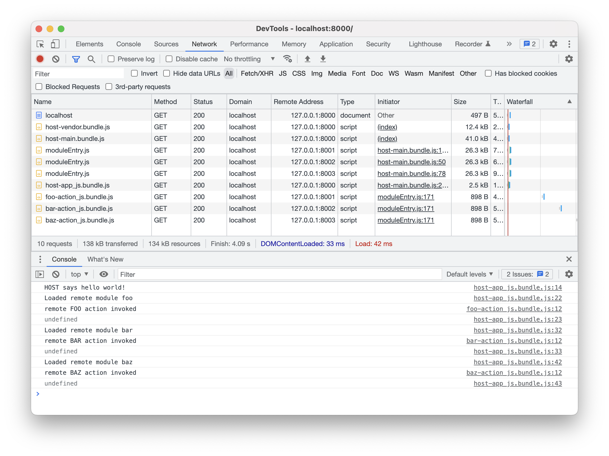

This repo provides a very simple demonstration of how Webpack's module federation works.

The repository contains four projects:

- A host app project `host-app`
- Three remote module projects: `remote-module-foo`, `remote-module-bar` and `remote-module-baz`

The host app and the three remote modules are all served from their own local server:

- host on `localhost:8000`
- remote module foo on `localhost:8001`
- remote module bar on `localhost:8002`
- remote module baz on `localhost:8003`


## Setup

1. `yarn install`
2. `yarn project:install:all`
3. `yarn project:build:all`


## Running the Demonstration

- To serve host and the remote modules, run `yarn project:serve:all`
- To shutdown the local servers, run `yarn project:shutdown:all`

When the servers are all running, open your browser and go to `http://localhost:8000`. In your browser's JavaScript console, you should see the following output:

```
LOADED remote module foo
remote foo action invoked
LOADED remote module bar
remote bar action invoked
LOADED remote module baz
remote baz action invoked
```

In your browser's inspector network tab, you should see the following files being loaded in this order:

```
localhost:8000: index.html
localhost:8000: bundle.js
localhost:8001: moduleEntry.js
localhost:8002: moduleEntry.js	
localhost:8003: moduleEntry.js	
localhost:8001: a_action_js.js
localhost:8002: b_action_js.js
localhost:8003: c_action_js.js
```



### What's Happening In this Demonstration?

When you load the host app, the app's `main` [function](https://github.com/mlcohen/simple-webpack-module-federation-demonstration/blob/main/host-app/src/main.js) will execute. When invoked, the `main` function will dynamically import three modules: First `RemoteModuleFoo/action` then `RemoteModuleBar/action` and finally `RemoteModuleBaz/action`.

When a remote module has been loaded, the host app will execute an exported function from imported module. For the foo remote module, the exported `doRemoteFooAction` [function](https://github.com/mlcohen/simple-webpack-module-federation-demonstration/blob/main/remote-module-foo/src/a/action.js) is invoked, and for the bar remote module, the exported `doRemoteBarAction` [function](https://github.com/mlcohen/simple-webpack-module-federation-demonstration/blob/main/remote-module-bar/src/b/action.js) is invoked, and for the baz remote module, the exported `doRemoteBazAction` [function](https://github.com/mlcohen/simple-webpack-module-federation-demonstration/blob/main/remote-module-baz/src/c/action.js) is invoked.

Each remote module is loaded in series with a bit of delay added in between. This is to help emphasize how remote module are loaded by Webpack.

### What is Module Federation?

Module federation allows any project made up of a collection of modules to be built, bundled and deployed in a way where they can be dynamically fetched and loaded at runtime by a Webpack compliant host. These federated modules, also referred to as _remote modules_ do not need to be available at build time for the host to be built. The benefit is that each project representing a federated module can be independently maintained, tested, built and deployed. This means the applications that host remote modules can then be smaller, quicker to build, quicker to load, and not be concerned about how each federated module is built and deployed. All that a host needs to know is:

1. The name of the federated module
2. What a federated module exports for public use
3. Where the federated module can be fetched from

Module federation opens the doors for microfrontends where you can independently maintain and deploy small web applications such that each application can be both a host _and_ a remote module. This is referred to as _bidirectional hosting_.

### How Does Module Federation Work?

Let's start with the basics: Setting up projects representing a host and remote modules.

#### Setting Up a Remote Module

For any project that is representing a remote module, you need to include Webpack's `ModuleFederationPlugin` [plugin](https://webpack.js.org/plugins/module-federation-plugin) in the project's `webpack.config.js` file. At a minimum, you specify:

1. The *name* of the remote module
2. The name of the file representing the remote module's entry
3. What the remote module exposes for use

For example, let's say you want to create a remote module *Foo* that exports (or _exposes_) a submodule called _action_. You'd have the following:

```js
// webpack.config.js (using Webpack v5)
const ModuleFederationPlugin = require("webpack/lib/container/ModuleFederationPlugin");

const config = {
    ...
    plugins: [
        new ModuleFederationPlugin({
            name: "Foo",
            filename: "moduleEntry.js",
            exposes: ["./action"],
        }),
    ],
};

module.exports = config;
```

Each part in the remote module project's configuration is important as it will be needed by a host to use it.

#### Setting up a Host

Setting up the host application to use remote modules requires:

1. Updating the app's `webpack.config.js` file to use the `ModuleFederationPlugin` plugin
2. Making use of the global `import()` function to import _exposed_ submodules from a remote module

##### Configuring the Host

Like remote modules, the host application also makes use of Webpack's `ModuleFederationPlugin` plugin but, unlike remote modules, you are configuring the plugin to tell it what remote modules to use and how the host retrieves the remote modules. Here we want the host to use the *Foo* remote module.

```js
const ModuleFederationPlugin = require("webpack/lib/container/ModuleFederationPlugin");

const config = {
    ...
    plugins: [
        new ModuleFederationPlugin({
            name: "host",
            remotes: {
                Foo: `promise new Promise((resolve) => {
                    const script = document.createElement("script");
                    script.src = window.FooUrl + "/moduleEntry.js";
                    script.onload = () => {
                        const m = {
                            get: (request) => window.Foo.get(request),
                            init: (arg) => {
                                try {
                                    return window.Foo.init(arg);
                                } catch (e) {
                                    console.log("Foo has already been loaded");
                                }
                            },
                        };
                        resolve(m);
                    }
                    document.head.appendChild(script);
                }`,
            },
        }),
    ],
};
```

We use the plugin's `remotes` field to tell Webpack that we want to use the *Foo* remote module. The value assigned to the key _Foo_ is a stringified promise. This promise is what Webpack will use to fetch and load the remote module. The promise will create a DOM script element to fetch the remote module's entry file (`moduleEntry.js`). Once the entry file has been retrieved and loaded, the promise is resolved by passing back the *Foo* module's entry interface (an `init` and `get` function). This interface is what Webpack uses to import functionality from the remote module.

Do you really need to explicitly write this promise logic? Well, no. You could instead use the `ExternalTemplateRemotesPlugin` [plugin](https://www.npmjs.com/package/external-remotes-plugin) that will essentially do the same thing. But seeing the promise logic makes it clear how Webpack goes about retrieving and loading remote modules. 

##### Importing Remote Modules

For a host application to import something from a remote module, the application must use the `import()` function. `import` is an [ES6 feature](https://developer.mozilla.org/en-US/docs/Web/JavaScript/Reference/Operators/import) that all major browser vendors (and nodejs) implement. To import something from the *Foo* remote module, we do the following:

```js
import('Foo/action').then(({ doAction }) => {
    doAction();
});
```

It's that simple.

Above, we want to access the `doAction` function in the `Foo/action` module. `import` returns a promise and when resolved returns the module that gives you access to what the module exports. Behind the scenes, Webpack is doing a lot of work to carefully retrieve and load the `action` module.